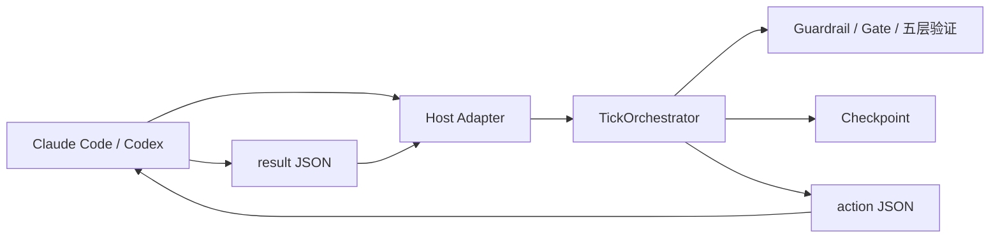

# v5.6 Loop Engineering 当前设计基线

> 更新：2026-08-02｜状态：当前实现基线；v5.8 ProjectProfile 与自动上下文扩展已落地
> 已批准目标：`design/v5.7-Protocol-Kernel-Design.md`

## 1. 产品与架构边界

Auto-Engineering 是 Python CLI + Agent Plugin 形态的 Loop Engineering 调度器。Core
只做确定性状态转换，不直接调用 LLM；宿主 Agent 读取 action、执行推理与工具调用，
再提交 result。Init Engineering 是独立项目；当前实现消费其 manifest，已批准的 D16
将运行时输入迁移为中立 ProjectProfile，并把 Init 降为可选兼容 Provider。



禁止 Core 依赖 `.claude-plugin/`、`.codex-plugin/`、宿主 SDK 或 transcript 格式。

## 2. Tick 协议

共享 resolver：

```bash
scripts/ae-run dev-loop --init "需求"
scripts/ae-run dev-loop --tick --result result.json
scripts/ae-run status --format json
scripts/ae-run dev-loop --resume
```

每次 Tick 是独立 Python 进程：

1. 读取 checkpoint 与可选 result。
2. 校验 result 所属 thread/tick/stage。
3. 执行确定性 StageRouter、Guardrail、Gate 与收敛判断。
4. 原子写回 checkpoint。
5. stdout 只输出 action JSON；诊断信息写 stderr。

`TickOrchestrator` 是唯一状态机实现。退役的连续 while loop、standalone driver、
`ae agent`、`ae progress`、`ae gate-check` 不属于当前公共能力。

### 2.1 Phase 0：Gap Review / Research 原子边界

1. `gap_scan` 一次返回完整 gap report；无 gap 时进入 Architect。
2. `gap_review` Action 暴露当前全部未决 `gaps`。宿主按顺序逐项与用户确认，
   但只在宿主本地累积选择；全部完成后，用一个 Result 原子提交完整 `decisions`。
3. Core 校验 decision 的 `gap_id` 集合与 Action 中未决 gap 集合完全一致；遗漏、重复、
   未知 ID 均返回稳定错误且不推进状态。禁止把“逐项询问”改写成“单 gap 单 Tick”。
4. Fill 写入 DesignDoc Supplement；Research 与 Defer+Research 进入有序研究队列。
5. Research 每个 gap 使用一个 Tick。Research 完成后，有 Defer+Research 才回到
   `gap_review` 复审；否则只有在研究队列清空后进入 Architect。

状态转换：`gap_scan → gap_review → research* → gap_review? → architect`。宿主交互粒度
与 Core 状态提交粒度是两件事：前者逐项，后者对一次 Action 原子提交。

## 3. Host Adapter

`auto_engineering.host.HostAdapter` 是宿主差异唯一边界：

```python
platform: HostPlatform
capabilities: HostCapabilities
normalize_event(raw) -> HostEvent | None
resolve_cli(plugin_root) -> tuple[str, ...]
usage_source(project_root) -> UsageSource | None
```

- Claude Code：入口 `/auto-engineering:dev-loop`；支持 command、Hook、交互问题和 transcript usage。
- Codex：入口 `$auto-engineering`；支持 Skill 与 Hook；不虚构 transcript usage。
- 两者共用 `scripts/ae-run`、Core、schemas、prompts 与验证语义。
- 未实现平台必须返回显式不可用错误，不得隐式伪装为 Claude。

## 4. 状态、Checkpoint 与错误

- `.ae-state/` 是本地运行状态目录。
- SQLite checkpoint 使用 WAL；跨进程恢复必须保留 thread、tick、stage、batch 与进度树。
- result schema 与 action schema 是文件桥接契约，未知必需字段 fail-closed。
- Core 在 Action 持久化和输出前按 `action.schema.json` v1.1 校验；schema 漂移不得留给宿主真跑发现。
- 用户可见错误使用中文；`error_code` 使用稳定英文标识。
- 路径与 Git 写操作受 capability 与用户授权双重约束。

## 5. Guardrail、Gate 与五层验证

确定性检查不可由提示词自觉替代：

1. Guardrail：Stage 前后约束，返回 pass/block/retry。
2. Gate：safety → lint → type_check → audit → contract → test → build。
3. 五层验证：critic → component verifier → plate deep audit → system verifier →
   system deep audit。

验证按变更范围裁剪，但不得短路必需层。B 级 hybrid gate 只可跳过用户签字，
不可跳过自动 code review。缺陷修复必须有回归测试。

- ProjectProfile 命令由 `ProfileCommandGate` 执行；timeout、not-found、OSError 和负退出码
  必须保留实际 command 与结构化原因，禁止只报告空的 `exit=-1`。
- Audit P0/P1 按阈值阻断；P2 默认只告警，只有显式非负阈值才可阻断。
- ContractGate 只以 EngineState 的 `contracts` 判断适用性：非空则执行，空/未注入则 N/A；
  spawn proof 仅证明 Agent 执行，不等价于存在跨模块契约。

## 6. ProjectProfile 与 Init-Loop 兼容契约

当前实现由 Init Engineering 的 `.ae-state/init-manifest.json` 提供项目类型、语言、
源码/测试根和工具约定。Phase 73 将按 D16 迁移：

- Core 通过版本化 `ProjectProfile` 消费项目能力，不感知能力提供者。
- 本地确定性探测是默认 Provider；`ae.toml` 可提供显式覆盖。
- 旧 Init manifest 通过只读 Adapter 兼容，不再是启动前置条件。
- 只有设计文档的项目发出 `project_setup_required` Action，由宿主搭建后重新探测。
- Core 不实现 Init 的回答、模板或脚手架。

完整目标设计见 `design/v5.8-Init-Runtime-Decoupling-Design.md`。

## 7. 配置与依赖 SSOT

- `FeatureManifest` 定义全部 `AE_*` 功能元数据与默认值。
- `RuntimeConfig` 提供类型化访问；业务代码不得散落直接读取。
- `pyproject.toml` 定义版本、依赖与测试基线。
- Anthropic/OpenAI SDK 是可选 Provider extra，不是 Core 强制依赖。
- Plugin manifest 只声明宿主资产，不复制运行配置默认值。

## 8. Release 验收

验收报告必须分层：

| 层级 | 自动化内容 | 状态语义 |
|---|---|---|
| `archive_smoke` | 解压、package contract、隔离安装、doctor、minimal Tick | `pass` / `fail` |
| `product_install` | 在真实 Claude Code 或 Codex 产品内安装并运行 | `pass` / `fail` / `not_run` |

模拟环境变量只能证明 archive smoke，不能证明真实产品安装。未执行真实安装时必须记录
`not_run` 与原因。

## 9. 可测试验收

- While Agent 提交合法 result, when Core 执行下一 Tick, the system shall 原子推进状态并输出唯一 action。
- While Gap Review 含多个未决 gap, when 宿主提交 Result, the Core shall 只接受完整、无重复且无未知 ID 的 decisions 集合。
- While Core 输出任意 Action, when Action 被持久化或返回宿主, the system shall 先通过 v1.1 action schema。
- While `ae status --format json` 从 EventStore 读取 active projection, when 返回公共状态, the CLI shall 保持既有 7 字段契约。
- While 新宿主实现 Adapter, when Core 测试运行, the Core shall 不导入宿主专属 SDK 或 manifest。
- While 配置未显式提供, when RuntimeConfig 读取值, the system shall 使用 FeatureManifest 默认值。
- While Init manifest 缺失但项目事实可识别, when dev-loop 启动, the system shall
  解析 ProjectProfile 并继续，不得要求 Init Engineering 前置运行。
- While archive smoke 通过且真实安装未执行, when 生成报告, product_install shall 为 `not_run`。
- While 设计入口被读取, when 查找当前状态, the reader shall 从 BEACON 与 Tracker 获得一致结论。

## 10. 追溯

- 当前状态：`design/BEACON.md`
- 当前任务：`design/IMPLEMENTATION-TRACKER.md`
- v5.7 目标设计：`design/v5.7-Protocol-Kernel-Design.md`
- 历史里程碑与恢复方式：`design/HISTORY.md`
