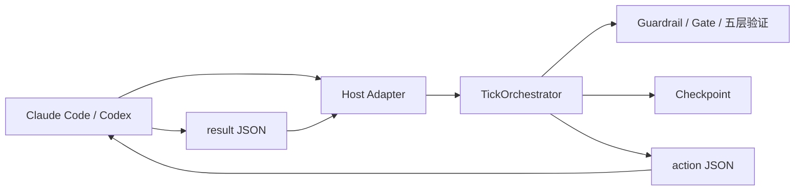

# v5.6 Loop Engineering 当前设计基线

> 更新：2026-07-27｜状态：当前有效
> 完整历史规格：`design/archive/legacy/v5.6-Design-Loop-full-history.md`

## 1. 产品与架构边界

Auto-Engineering 是 Python CLI + Agent Plugin 形态的 Loop Engineering 调度器。Core
只做确定性状态转换，不直接调用 LLM；宿主 Agent 读取 action、执行推理与工具调用，
再提交 result。Init Engineering 是独立项目，本项目只消费其 manifest。



禁止 Core 依赖 `.claude-plugin/`、`.codex-plugin/`、宿主 SDK 或 transcript 格式。

## 2. Tick 协议

共享 resolver：

```bash
scripts/ae-run dev-loop --init "需求"
scripts/ae-run dev-loop --tick --result result.json
scripts/ae-run status --format json
scripts/ae-run dev-loop --resume
```

每次 Tick 是独立 Python 进程：

1. 读取 checkpoint 与可选 result。
2. 校验 result 所属 thread/tick/stage。
3. 执行确定性 StageRouter、Guardrail、Gate 与收敛判断。
4. 原子写回 checkpoint。
5. stdout 只输出 action JSON；诊断信息写 stderr。

`TickOrchestrator` 是唯一状态机实现。退役的连续 while loop、standalone driver、
`ae agent`、`ae progress`、`ae gate-check` 不属于当前公共能力。

## 3. Host Adapter

`auto_engineering.host.HostAdapter` 是宿主差异唯一边界：

```python
platform: HostPlatform
capabilities: HostCapabilities
normalize_event(raw) -> HostEvent | None
resolve_cli(plugin_root) -> tuple[str, ...]
usage_source(project_root) -> UsageSource | None
```

- Claude Code：入口 `/ae:dev-loop`；支持 command、Hook、交互问题和 transcript usage。
- Codex：入口 `$auto-engineering`；支持 Skill 与 Hook；不虚构 transcript usage。
- 两者共用 `scripts/ae-run`、Core、schemas、prompts 与验证语义。
- 未实现平台必须返回显式不可用错误，不得隐式伪装为 Claude。

## 4. 状态、Checkpoint 与错误

- `.ae-state/` 是本地运行状态目录。
- SQLite checkpoint 使用 WAL；跨进程恢复必须保留 thread、tick、stage、batch 与进度树。
- result schema 与 action schema 是文件桥接契约，未知必需字段 fail-closed。
- 用户可见错误使用中文；`error_code` 使用稳定英文标识。
- 路径与 Git 写操作受 capability 与用户授权双重约束。

## 5. Guardrail、Gate 与五层验证

确定性检查不可由提示词自觉替代：

1. Guardrail：Stage 前后约束，返回 pass/block/retry。
2. Gate：safety → lint → type_check → audit → contract → test → build。
3. 五层验证：critic → component verifier → plate deep audit → system verifier →
   system deep audit。

验证按变更范围裁剪，但不得短路必需层。B 级 hybrid gate 只可跳过用户签字，
不可跳过自动 code review。缺陷修复必须有回归测试。

## 6. Init-Loop 契约

Init Engineering 通过 `.ae-state/init-manifest.json` 提供项目类型、语言、源码/测试根、
配置、入口与工具约定。本项目：

- 只读消费，不修改 Init 产物。
- 使用版本化 JSON Schema 校验。
- 不存在或不兼容时给出可操作错误。
- 不把 Init 实现、回答文件或模板纳入本仓库。

## 7. 配置与依赖 SSOT

- `FeatureManifest` 定义全部 `AE_*` 功能元数据与默认值。
- `RuntimeConfig` 提供类型化访问；业务代码不得散落直接读取。
- `pyproject.toml` 定义版本、依赖与测试基线。
- Anthropic/OpenAI SDK 是可选 Provider extra，不是 Core 强制依赖。
- Plugin manifest 只声明宿主资产，不复制运行配置默认值。

## 8. Release 验收

验收报告必须分层：

| 层级 | 自动化内容 | 状态语义 |
|---|---|---|
| `archive_smoke` | 解压、package contract、隔离安装、doctor、minimal Tick | `pass` / `fail` |
| `product_install` | 在真实 Claude Code 或 Codex 产品内安装并运行 | `pass` / `fail` / `not_run` |

模拟环境变量只能证明 archive smoke，不能证明真实产品安装。未执行真实安装时必须记录
`not_run` 与原因。

## 9. 可测试验收

- While Agent 提交合法 result, when Core 执行下一 Tick, the system shall 原子推进状态并输出唯一 action。
- While 新宿主实现 Adapter, when Core 测试运行, the Core shall 不导入宿主专属 SDK 或 manifest。
- While 配置未显式提供, when RuntimeConfig 读取值, the system shall 使用 FeatureManifest 默认值。
- While archive smoke 通过且真实安装未执行, when 生成报告, product_install shall 为 `not_run`。
- While 设计入口被读取, when 查找当前状态, the reader shall 从 BEACON 与 Tracker 获得一致结论。

## 10. 追溯

- 当前状态：`design/BEACON.md`
- 当前任务：`design/IMPLEMENTATION-TRACKER.md`
- Phase 50 定型设计：`design/phase50-codex-migration-closure-design.md`
- 历史规格与决策：`design/archive/INDEX.md`
