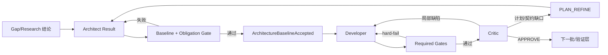

# v5.8 Architecture Baseline 与确定性修复控制设计

> 状态：Phase 78 权威设计｜日期：2026-08-06｜关联：T387-T396

## 1. 目标与边界

修复 rc.5 真跑中 Gate fail-open、Architect 事实离场丢失、计划义务漏检、Critic
错误返修路由、修复预算混用、Profile 命令污染与 spawn proof 职责混杂。保留批量
Gap Review、Research 队列、Core 不调用 LLM、EventStore 为事实源等既有决策。

不在 Core 中判断业务架构是否“正确”，不新增 Agent 角色，不靠扩大 Tick/MAJOR 上限
收敛，也不把研究全文、聊天历史或完整设计文档重复注入各 Stage。

## 2. 根本模型



`ArchitectureBaseline` 是 Architect 已接受输出的持久事实投影；Architect 的 `plan`、
`batch_plan`、`contracts` 仍是临时输入通道，可在离场时清理。后续 Stage 只读取基线，
不得依赖临时字段。

## 3. ArchitectureBaseline

### 3.1 数据契约

```text
ArchitectureBaseline
  schema_version: "1.0"
  revision: positive int
  baseline_id: sha256(canonical payload)
  design_doc_ref: {path, digest}
  plan_summary: bounded string
  batch_plan: normalized batches
  contracts: map<string, ContractSpec>
  obligations: list<DesignObligation>
  accepted_at_tick: int
```

`DesignObligation` 只表达可确定性验证的覆盖关系：

```text
id, source_kind(gap|research|supplement|design), source_ref,
summary, implementation_targets[], verification_targets[], contract_refs[]
```

`ContractSpec` 至少具有 `kind`，API 契约使用 `path`、`method`、`request`、`response`、
`status_codes`。非对象值在 Architect Result 校验阶段拒绝，ContractGate 不再静默跳过。

### 3.2 生命周期

1. Architect Result 先做 schema、执行树和义务覆盖 dry-run。
2. 通过后规范化并计算 `baseline_id`，记录 `ARCHITECTURE_BASELINE_ACCEPTED` 事件。
3. EngineState 保存有界 `architecture_baseline` 投影；checkpoint/replay 必须等价。
4. PlanPatch 生成 revision+1；完成批次事实由 BatchState 保留，不能被基线覆盖。
5. `clear_stage_fields("architect")` 不影响 ArchitectureBaseline。

PLAN_REFINE 的 Result 只允许提交
`plan_patch={base_revision, add_batches}`。`add_batches` 使用 revision 唯一 ID，并表达缺口修复
的新增工作；不得重发整棵 `batch_plan`、替换同 ID payload 或重新打开已完成 batch。Core
必须在状态变更前按当前 Stage 上下文校验该分支，错误 Result 返回 Architect 重试反馈，
不得进入 BatchState 初始化后才以未处理异常退出。

## 4. 义务覆盖门禁

Core 不理解自然语言业务含义；Architect 必须显式提交 `obligations`。门禁验证：

- 每个 Research/Supplement 来源至少有一个 obligation 引用；
- 每个 obligation 至少绑定一个实现 task 和一个 verification task；
- task ID、file target、contract ref 必须存在于同一 Result；
- `verification_targets` 必须指向 `kind=test|contract_test` 的 task；
- source_ref、task ID、contract ref 不得重复或悬空。

Contract Gate 采用义务驱动激活：对每个 contract，汇总引用它的 obligation 的全部
`implementation_targets`；只有这些 task 所属 batch 均处于当前或已完成集合时，contract
才进入 required Gate。未到达的 contract 不是 pass，也不是 skip，只是尚未激活。未绑定
obligation 的兼容 contract 保持立即激活，避免旧协议静默失去验证。

旧 Result 没有 obligations 时兼容策略为：无 Research/Supplement 的普通流程允许空集合；
存在 Research/Supplement 时 fail-closed，错误码 `ARCHITECT_OBLIGATION_COVERAGE_MISSING`。

## 5. Gate 参与状态转移

Gate verdict 统一为 `pass | hard_fail | not_applicable`。DeveloperHandler 的
TransitionContext 必须包含 `blocking_gate_results`：

- 非空：保持 Developer、不得 advance batch、不得生成 Critic、返回结构化 gate feedback；
- 为空：按既有 Batch cursor 规则推进；
- required Gate 的 N/A 只有 Profile/基线显式声明不适用时合法；
- Gate 结果与 Developer snapshot digest 一起进入 BatchReviewContext。

能力命令不可执行属于 `project_capability` Finding；Core 保持 Developer 工作事实，重新解析
ProjectProfile 或发出既有 `project_setup_required`，不把环境问题交给 Critic。

## 6. ProjectProfile 命令权威性

命令来源优先级仍为显式 AE 配置 > 本地事实 > Legacy Adapter，但“缺失字段合并”增加
新约束：低优先级命令只有通过当前项目入口事实验证才可补入。

Node/TypeScript 确定性规则：

1. 有 `typecheck|type-check|check-types` script：`<pm> run <script>`。
2. 无 script，但存在 `tsconfig.json` 且 package 声明 `typescript` 依赖：
   pnpm=`pnpm exec tsc --noEmit`，npm=`npm exec -- tsc --noEmit`，
   yarn=`yarn exec tsc --noEmit`。
3. 只有 tsconfig、没有本地 TypeScript 声明：能力缺失，不猜测全局 `tsc`。
4. Legacy 裸命令与本地事实冲突时忽略并产生可审计 conflict，不标 confirmed。

## 7. Critic 路由与修复控制

Finding 扩展兼容字段：`finding_id`、`kind`、`design_ref`、`task_ref`、`contract_ref`。
`kind` 取值：`implementation_defect | plan_gap | contract_gap | project_capability`。

确定性路由：

- `implementation_defect` 且文件在当前 task/batch 允许范围：rollback batch → Developer；
- `plan_gap|contract_gap`，或 Finding 文件超出允许范围：PLAN_REFINE → Architect；
- `project_capability`：Profile/setup 恢复路径；
- 缺 `kind` 的旧 Result：文件越界推导为 `plan_gap`，否则视为实现缺陷。

计数分离：`repair_cycle_count` 统计局部返修；`plan_refine_count` 沿用架构修订预算；
`unchanged_finding_streak` 只在规范化 Finding 指纹和证据摘要均未变化时递增；
`total_majors` 只用于度量。达到 `max_repair_cycles` 返回 `REPAIR_CYCLE_LIMIT`，达到
停滞阈值返回 `STAGNANT`，不再用固定连续 3 次 MAJOR 代替两者。

## 8. BatchReviewContext 与上下文预算

Critic 接收有界结构：`baseline_ref`、`plan_revision`、`batch_id`、`task_ids`、
`obligation_ids`、`contract_refs`、`allowed_file_targets`、`cumulative_changed_files`、
`gate_results`、`open_findings`、`resolved_finding_ids`。大正文使用 ArtifactRef。

每次 Developer Result 将 `files_changed` 去重合并到当前 batch 累积集合；批次 APPROVE 后
清空。禁止只传最后一次 repair 文件，也禁止重新内联全部 Research 文本。

## 9. Spawn Challenge 与 Host Receipt

Core 创建不可变 challenge：token、thread、Action message、stage、worker role/effort、
created_at。Worker 不修改 challenge。宿主原生派生完成后创建 receipt：challenge_id、
host、worker identity、status、artifact refs、result/artifact digest、completed_at。

Core 校验 challenge/receipt/Result 的因果绑定和 digest；旧 proof 在迁移期只读兼容，
不得再要求 Worker 覆写 Core 文件。这里是宿主声明与审计回执，不宣称密码学远程证明。

## 10. EARS 验收

- While required Gate hard-fail, when Developer Result 被处理, the system shall 保持
  Developer 且不得推进 batch 或产生 Critic Action。
- While Architect Result 被接受, when Stage 清场、进程恢复或 PlanPatch 发生, the system
  shall 读取相应 revision 的同一 ArchitectureBaseline。
- While Research/Supplement 存在, when obligation 缺实现或验证任务, the system shall
  在 Developer 前拒绝 Architect Result。
- While Critic Finding 越出当前允许边界, when 路由, the system shall PLAN_REFINE 而非
  局部返修。
- While Finding 指纹相同但证据有增量, when 重新审查, the system shall 不增加停滞计数；
  指纹和证据均无变化时 shall 增加并在阈值处返回 STAGNANT。
- While pnpm TypeScript 项目具备本地 TypeScript, when Profile 解析, the system shall
  使用 `pnpm exec tsc --noEmit`，不得回退裸 `tsc`。
- While Host Receipt 被提交, when challenge 或 digest 不匹配, the system shall fail-closed
  且不接受 Agent Result。
- While PLAN_REFINE 等待 Architect Result, when Result 重发完整 batch_plan 或 revision
  不匹配, the system shall 在修改状态前拒绝并返回结构化重试错误。
- While contract 的实现义务跨越多个 batch, when 当前 batch 尚未到达全部实现目标, the
  system shall 不提前执行该 contract；到达最后实现 batch 后 shall 将其作为 required Gate。

## 11. 验证与发布

专项 TDD 后依次运行状态重放、黄金轨迹、全量 pytest、90% 覆盖率、Ruff、mypy、规则同步、
元数据和双宿主 archive install。自动验证通过只获得真实产品重跑资格；事故关闭仍要求
Claude/Codex 真跑覆盖 Gate 失败、PLAN_REFINE、跨进程恢复和 Host Receipt。
