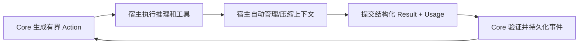

# Auto-Engineering v5.8 自动上下文与成本治理设计

> 状态：T341-T349 已实施，T350 待真实长跑｜日期：2026-07-30
> 事故基线：`incidents/2026-07-29-claude-146-tick-long-run.md`
> 本文修正 `v5.8-Session-Decoupling-Design.md` 中“固定 Tick 触发日常
> session rollover”的设计；事件状态、恢复 Capsule 和幂等接管能力继续保留。

## 1. 决策摘要

Auto-Engineering 不再用 Tick 数判断宿主上下文是否需要切换，也不在正常开发流程中
要求用户手工交接会话。

采用以下分层：

1. Claude Code、Codex 负责其活动上下文窗口、自动 compaction 和宿主 transcript。
2. Core 只编译当前 Stage 必需的有界增量上下文，不复制完整历史、完整产物或重复块。
3. Tick、repair、Worker、audit 限额只用于检测流程不收敛，不用于上下文轮换。
4. `ResumeCapsule`、claim 和 `ExecutionSession` 只用于进程退出、宿主崩溃、显式恢复
   或真正的跨宿主接管，不参与正常 compaction。
5. Usage Ledger 分别记录活动输入、cache read/write、output、Core payload 和估算来源，
   禁止用 cache-read 或 Tick 数冒充活动上下文长度。

用户正常只启动一次 `dev-loop`。宿主自动 compact 时，Core 状态继续从 Event Store
和 active Action 读取；用户不应看到“会话限额到达，需要交接”。

## 2. 业界事实与适用边界

### 2.1 已核验机制

| 产品 | 上下文治理 | 循环保险丝 |
|---|---|---|
| Claude Code | 接近窗口时先清旧工具输出，再自动总结并继续 | `--max-turns` 约束非交互运行 |
| Claude API | 按 input token 阈值产生 compaction block 并继续 | 由调用方另行控制 |
| OpenAI Agents SDK | Session history 自动 compaction/重写 | Runner 另行控制 |
| LangGraph | Checkpoint 与应用级上下文裁剪 | recursion limit 防无限图循环 |
| AutoGen | TokenLimited Context 控制模型输入 | max turns/tool iterations 防无限循环 |

官方参考：

- <https://code.claude.com/docs/en/how-claude-code-works>
- <https://code.claude.com/docs/en/context-window>
- <https://platform.claude.com/docs/en/build-with-claude/compaction>
- <https://openai.github.io/openai-agents-python/sessions/>
- <https://docs.langchain.com/oss/python/langgraph/graph-api>
- <https://microsoft.github.io/autogen/stable/user-guide/agentchat-user-guide/tutorial/agents.html>

### 2.2 不直接照搬的部分

- Core 不直接调用模型 API，不能配置 Claude/OpenAI server-side compaction 参数。
- Plugin/Skill 不能假定拥有创建顶层宿主会话的工具。
- 宿主 usage 字段可能缺失或语义不同，必须保留 source 与 estimated 标志。
- 自动 compaction 可能丢失聊天中的细节，因此业务状态不能依赖 transcript 或 recap。

## 3. 事故成本模型

146-Tick 真跑观察到约 58m input、341m cache、1m output，Core Prompt JSON 153 份、
约 3.7MB。能够确认的是请求最终因输入长度超限失败；不能仅凭这些数字断言每类成本
的精确占比。

必须区分：

```text
Core payload
  = 当前 Action JSON、Stage Prompt、结构化上下文与引用

Host active context
  = system/rules/skills + transcript + 文件/工具输出 + 当前 Core payload

Billing usage
  = 多次模型调用累计 input/cache-read/cache-write/output
```

- `cache_read_units` 是累计计费/观测量，不等于当前活动窗口。
- Prompt Log 只记录 Core 渲染结果，不等于宿主发送给模型的完整请求。
- 同一块内容命中 cache 仍可能产生大量累计读取成本。
- 单个巨大工具输出可能绕过正常增长曲线，使 auto-compaction 来不及完成。

因此成本治理必须同时覆盖“单次大小、重复率、累计量和来源”，不能再用一个 Tick
阈值代理所有问题。

## 4. 目标与非目标

### 4.1 目标

1. 正常长跑由宿主自动 compaction，Auto-Engineering 无感继续。
2. 每个 Action 只包含当前 Stage 的最小充分上下文。
3. 稳定规则、完成事实和大型产物只传引用或哈希，不在每 Tick 重复正文。
4. 对 input/cache/output 的增长能够按 stage、worker、payload block 归因。
5. 在 compaction、进程重启或摘要漂移后，业务投影与下一 Action 保持一致。
6. 真实长跑不得再次发生输入长度超限、已完成批次回退或摘要驱动状态推进。

### 4.2 非目标

- 不替代 Claude Code/Codex 的上下文窗口实现。
- 不新增用户可见的 Supervisor 或会话管理命令。
- 不通过提高上下文上限掩盖重复输入。
- 不承诺宿主服务故障、认证失效或付费额度耗尽时仍无人值守。
- 不把压缩摘要升级为状态事实或验证证据。

## 5. 领域边界

```text
EngineeringThread        长期业务身份；跨进程、跨宿主
ExecutionSession         一次宿主执行实例；仅恢复与审计
HostConversation         宿主内部 transcript；Core 不拥有
Action                   当前确定性工作指令
ContextManifest          本次 Action 使用的块、引用、大小和哈希
UsageSample              一次宿主调用的用量观测
ResumeCapsule            异常恢复最小包；非日常 compaction 包
```

宿主 compaction 前后仍属于同一 `ExecutionSession`。只有进程退出、宿主创建新的真实
执行实例或跨宿主接管时，才开始 successor session。

## 6. 正常自动运行



规则：

- Core 不检测宿主 transcript 是否“应该换会话”。
- 宿主 compaction 不产生业务 Result，不改变 thread/session/stage/tick。
- compaction 后 Skill、规则和 active Action 必须能从稳定资产重新加载。
- 状态恢复只读取 Event Store、投影、active Action 和 Artifact，不读取自由文本 recap。
- 宿主暴露可靠信号时可记录 `host_context_compacted`；未暴露时保持 unknown，不推断。
- 不得向用户输出“需要交接”。

## 7. 异常恢复

以下情况才使用 `ResumeCapsule`：

- Claude/Codex 进程退出后重启。
- 宿主明确返回 context overflow 且自动 compaction 已失败。
- 用户关闭任务后稍后继续。
- 不同宿主或不同机器接管同一 EngineeringThread。

恢复流程继续使用既有 capsule、claim token、SQLite 条件更新和旧 session 晚到
Result 拒绝能力，但恢复入口必须由现有 `dev-loop --resume`/宿主 Skill 自动消费，
不得增加新的管理命令。

正常 compaction 与异常恢复必须是两个不同事件和指标，禁止统称 rollover。

## 8. 有界增量上下文

### 8.1 ContextManifest

每个 Action 生成清单：

```json
{
  "schema_version": "1.0",
  "stage": "developer",
  "blocks": [
    {
      "id": "active-task",
      "sha256": "hex",
      "bytes": 2048,
      "mode": "inline",
      "authority": "event_projection"
    },
    {
      "id": "design-section",
      "sha256": "hex",
      "bytes": 256,
      "mode": "artifact_ref",
      "authority": "design"
    }
  ],
  "total_inline_bytes": 2304
}
```

编译器必须拒绝：

- 同一 Action 出现相同 block hash 两次。
- 同一事实同时出现在顶层、`context`、summary 和 spawn prompt。
- 完整计划、完整 manifest、完整历史 Gate 或完整 transcript 被默认内联。
- 大型正文先进入主 Action，再通过 ArtifactRef 重复引用。

### 8.2 Stage 最小上下文

| Stage | 必需内联 | 默认引用 |
|---|---|---|
| Architect | 需求、开放 finding、完成 ID、当前 revision | 全设计、历史计划 |
| Developer | active task、直接依赖、最新相关 finding | 设计章节、测试日志 |
| Critic | 当前 diff 摘要、验收条款、证据引用 | 完整文件、历史批次 |
| Verifier | 设计条目 ID、实现/测试证据、开放 finding | 全量 transcript |
| Deep Audit | 全局索引、分片边界、worker 契约 | 每个分片正文 |

### 8.3 多 Agent

- Coordinator Action 只携带 Worker 索引、角色、prompt ArtifactRef 和 receipt path。
- 每个 Worker 按需读取自己的 prompt artifact；其他 Worker 内容不进入其上下文。
- 主 Agent 只接收有界 receipt 和报告 ArtifactRef，不接收所有完整报告拼接。
- 合并器按 finding ID、severity 和证据引用去重，不按自由文本拼接。

## 9. Prompt 与工具输出控制

### 9.1 Prompt 组成预算

预算按块而不是只按总字节：

- invariant/rules：稳定、短小、按 hash 去重。
- active work：必须内联。
- evidence：默认引用，按 Stage 精确读取。
- historical context：默认禁止。
- schema：只注入当前 Result 所需字段。

任何裁剪不得删除安全规则、active task、验收标准或 Result schema。无法满足时返回
`ACTION_CONTEXT_TOO_LARGE`，同时指出最大 block 和替代引用方案。

### 9.2 工具输出

- 测试、lint、构建只内联退出码、摘要、失败定位和日志 ArtifactRef。
- 文件搜索只返回匹配片段，不回灌完整目录树。
- 大 diff 以文件清单、统计和按需 hunk 读取代替全量重复。
- Worker、Bash 和 MCP 输出必须在进入主上下文前经过字节门禁。
- 同一日志 Artifact 相同 hash 时复用，不随 Tick 复制。

## 10. Usage 与成本归因

`UsageSample` 至少包含：

```json
{
  "thread_id": "uuid",
  "execution_session_id": "uuid",
  "tick": 12,
  "stage": "developer",
  "worker_id": null,
  "input_units": 12000,
  "cache_read_units": 45000,
  "cache_write_units": 1000,
  "output_units": 800,
  "core_payload_bytes": 18000,
  "inline_unique_bytes": 12000,
  "duplicate_block_bytes": 0,
  "host_context_window_units": null,
  "source": "claude_code",
  "estimated": false
}
```

语义约束：

- 未提供的 usage 写 `null`，禁止写 0。
- `input_units`、`cache_read_units` 和 `host_context_window_units` 不得互相替代。
- 估算值必须记录算法版本。
- 每次 Action 记录 block hash，才能判断成本来自新信息还是重复信息。
- 报表同时展示总量、每 Tick 增量、每 Stage、每 Worker 和 Top 重复块。

## 11. 预算与保险丝

拆分为四类：

| 类型 | 触发依据 | 行为 |
|---|---|---|
| Action payload | inline bytes/block bytes | 引用化或 fail-closed |
| 宿主上下文 | 宿主原生窗口/compaction | 由宿主自动处理 |
| 累计成本 | input/cache/output ledger | 告警、审计和发布门禁 |
| 流程收敛 | repair/worker/audit/thread steps | 停止异常循环并诊断 |

移除 `max_session_ticks`。线程级总 Tick 保险丝必须：

- 命名为 `max_thread_ticks`，避免暗示会话容量。
- 默认值来自基准测试，不进入 standard Profile 的低阈值推荐项。
- 接近上限时检查 progress delta；有真实进展不得因固定小阈值切换会话。
- 连续无进展、状态环或预算耗尽时返回结构化 `LOOP_NOT_CONVERGING`。
- 不产生 `session_rollover`，不要求用户交接。

## 12. 防回归成本门禁

### 12.1 基准方法

使用同一 fixture、同一宿主版本和同一模型策略比较 before/after：

1. 记录 Core payload、host input、cache read/write、output。
2. 将新信息与重复 block 按 hash 分离。
3. 报告 P50/P95/最大单次值、累计值和每完成 work unit 的归一化成本。
4. 不用 Prompt Log 字节数推算模型 Token。
5. cache-read 单独报告，不并入活动上下文。

### 12.2 发布标准

- 150-Tick 长轨迹无需用户交接并完成；至少一个支持可控阈值的真实宿主必须观测到
  compaction，其他宿主未暴露信号时标记 unknown，不伪造事件。
- 无 `input length`/`prompt too long` 错误。
- `duplicate_block_bytes` 必须为 0；允许的重复稳定前缀单独标识为 host-managed。
- 同一 fixture 的累计值和每 work unit 归一化成本不得高于已批准基线；若模型或
  宿主版本变化，必须重新建立基线而不是伪比较。
- 单个 Action 超限测试必须在调用模型前失败。
- compaction 前后投影、active Action、完成集合和最终 verdict 等价。
- Usage 缺失时测试结果标记 `measurement_incomplete`，不得宣称成本门禁通过。

不预先拍脑袋规定“降低 50%”。第一轮真实基准用于建立数值阈值，之后发布版本必须
满足已批准的相对回归门禁。

## 13. 配置迁移

| 旧配置 | 处理 |
|---|---|
| `AE_SESSION_MAX_TICKS` | 弃用；读取时告警，不再触发正常 rollover |
| `AE_SESSION_MAX_SECONDS` | 弃用会话语义；仅保留执行实例观测 |
| `AE_CONTEXT_SOFT_INPUT` | 仅在宿主提供可靠活动窗口时作为告警 |
| `AE_CONTEXT_HARD_INPUT` | 不替代宿主上限；只做调用前 fail-closed |
| `AE_MAX_PROMPT_BYTES` | 保留，升级为 block-aware payload gate |

新增配置必须先进入 FeatureManifest，且 standard Profile 不再写入固定 Tick 会话阈值。

## 14. EARS 验收

1. While Claude Code/Codex 正常自动 compaction, when 下一 Tick 运行, the system
   shall 不改变 ExecutionSession、业务投影或 active Action，且不请求用户交接。
2. While 一个事实已以内联 block 提供, when Action 编译, the system shall 拒绝同
   hash 的第二份内联副本。
3. While Worker 产生大型报告, when Coordinator 接收结果, the system shall 只
   内联有界 receipt，并以 ArtifactRef 保存完整内容。
4. While 宿主只提供 cache-read 而不提供活动窗口, when ContextBudget 评估, the
   system shall 标记窗口 unknown，禁止用 cache-read 触发会话轮换。
5. While Tick 数增加但投影持续前进, when 流程保险丝评估, the system shall 不因
   固定小阈值触发 session rollover。
6. While 状态连续无进展或形成环, when thread step 保险丝命中, the system shall
   返回 `LOOP_NOT_CONVERGING` 和诊断证据，不创建 successor session。
7. While 宿主进程真正退出, when 原 thread 恢复, the system shall 使用既有
   ResumeCapsule/claim 幂等恢复，不依赖聊天历史。
8. While 真实长跑结束, when 成本门禁评估, the system shall 提供可归因的
   input/cache/output、重复块和测量完整性结论。

## 15. 决策记录

| ID | 决策 |
|---|---|
| ACG-D1 | 固定 Tick 不用于上下文管理 |
| ACG-D2 | 正常上下文压缩由宿主自动完成 |
| ACG-D3 | Core 负责有界、去重、引用化的增量上下文 |
| ACG-D4 | ResumeCapsule 仅用于真实执行实例恢复 |
| ACG-D5 | cache-read、input 和活动窗口是不同指标 |
| ACG-D6 | 流程保险丝与上下文预算独立 |
| ACG-D7 | 成本阈值必须由可重复基准建立，不拍脑袋设定 |
| ACG-D8 | 正常运行不新增命令、不要求用户会话交接 |
