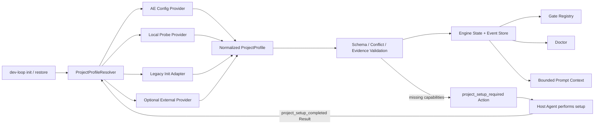

# v5.8 Init Engineering 运行时解耦设计

> 创建：2026-07-31｜状态：已批准设计，待实施｜实施阶段：Phase 73

## 1. 背景与问题

Auto-Engineering 的产品边界是跨 Agent 宿主的确定性工程治理内核，不实现项目模板、
问答收集或脚手架生成。当前实现虽然不调用 Init Engineering，却仍在启动、恢复、
Gate、Prompt 和 Doctor 中直接依赖 `.ae-state/init-manifest.json`，形成运行时硬耦合：

- 已有工程缺少 manifest 时可能被暂停，无法独立启动。
- 只有设计文档的空项目会静默回退到 Python 默认工具链。
- Gate 和角色 Prompt 感知 Init 专用文件，而不是中立项目能力。
- Doctor 把 Init Engineering 产物是否存在等同于 Auto-Engineering 是否健康。
- Init 专用 manifest 被反复传递，增加协议迁移和 Prompt 上下文成本。

本设计解除上述运行时依赖，但不把 Init Engineering 的初始化实现并入 Core。

## 2. 目标与非目标

### 2.1 目标

1. Auto-Engineering 在没有 Init Engineering 和 `init-manifest.json` 时可识别已有项目并启动。
2. 只有设计文档的空项目通过正常协议 Action 自动进入项目搭建，不中止 loop。
3. Gate、Prompt、Doctor 和状态机只依赖版本化 `ProjectProfile`。
4. 旧 Init manifest 通过只读 Adapter 兼容，迁移不破坏现有项目。
5. Profile 解析可审计、可重放、证据驱动且跨 Claude Code/Codex 语义等价。
6. Prompt 仅接收有界 Profile 摘要，不重复注入完整项目清单。

### 2.2 非目标

- Core 不选择产品技术栈，不生成 React/Vite/Python 等项目模板。
- Core 不调用 Init Engineering CLI、SDK、Agent 或服务。
- Core 不复制 Init Engineering 的问答、模板、答案和项目生命周期。
- 本阶段不移除旧 manifest 支持，也不要求 Init Engineering 同步发布。
- 不以猜测的语言或命令换取“自动继续”。

## 3. 设计原则

1. **能力契约中立化**：消费者依赖项目能力，不依赖能力由哪个产品产生。
2. **证据优先**：每个探测事实绑定来源与摘要；证据不足时返回缺失能力。
3. **确定性优先**：相同文件快照、配置和引擎版本产生相同 Profile。
4. **显式覆盖**：用户配置可以覆盖探测值，但冲突必须记录来源并按规则处理。
5. **失败关闭**：未经明确配置或本地证据证明的 Gate 命令不得执行。
6. **兼容迁移**：旧 manifest 是输入 Adapter，不再是领域模型或事实源名称。
7. **有界上下文**：Profile 完整事实留在 Core；Agent 只接收角色需要的摘要和引用。

## 4. 目标架构



`ProjectProfileResolver` 是唯一解析入口。状态机、Gate、Prompt 和 CLI 不得直接读取
`init-manifest.json`。Init Engineering 只可通过 `LegacyInitProvider` 或未来可选
Provider 提供输入。

## 5. ProjectProfile 契约

### 5.1 最小领域模型

```json
{
  "schema_version": "1.0",
  "profile_id": "sha256:<canonical-profile>",
  "project": {
    "type": "web_application",
    "languages": ["typescript"],
    "package_manager": "npm"
  },
  "paths": {
    "source_roots": ["src"],
    "test_roots": ["src", "tests"],
    "design_roots": ["design"]
  },
  "commands": {
    "install": ["npm", "install"],
    "lint": ["npm", "run", "lint"],
    "type_check": ["npm", "run", "typecheck"],
    "test": ["npm", "test", "--", "--run"],
    "build": ["npm", "run", "build"]
  },
  "evidence": [
    {
      "source": "package.json",
      "digest": "sha256:<content>",
      "facts": ["language:typescript", "script:test"]
    }
  ],
  "resolution": {
    "providers": ["local_probe"],
    "confidence": "confirmed"
  }
}
```

约束：

- 命令必须是非空参数数组，不接受 Shell 拼接字符串。
- 相对路径以规范化项目根为边界，不允许 `..`、绝对路径或符号链接逃逸。
- `profile_id` 不包含时间戳、宿主名和文件绝对路径等非确定性字段。
- `evidence` 只保存来源、摘要与事实标签，不保存完整依赖文件内容。
- `confidence` 仅允许 `confirmed`、`partial`；不得使用无法验证的概率值。

### 5.2 Core 所需能力

| 能力 | 必需阶段 | 缺失行为 |
|---|---|---|
| primary language | Gate 选择前 | `project_setup_required` |
| source roots | Developer/文件快照前 | `project_setup_required` |
| test roots | TestGate 前 | fail-closed 或机器可证 `not_applicable` |
| lint/type/test/build command | 对应 Gate 前 | fail-closed，不猜测默认命令 |
| package manager | 需要安装或脚本执行时 | `project_setup_required` |
| design roots | design-doc 模式 | 显式参数优先，否则有限探测 |

## 6. Provider SPI 与合并规则

### 6.1 Provider 接口

```python
class ProjectProfileProvider(Protocol):
    name: str

    def inspect(self, project_root: Path) -> ProfileContribution:
        ...
```

`ProfileContribution` 只表达候选事实、证据、缺失能力和诊断，不直接产生最终 Profile。

### 6.2 Provider 顺序

1. `AeConfigProvider`：读取 `ae.toml [project]` 的显式覆盖。
2. `LocalProbeProvider`：读取有限、已知的工程入口文件。
3. `LegacyInitProvider`：只读转换现有 `init-manifest.json`。
4. `ExternalProvider`：预留 SPI，本阶段不实现远端调用。

顺序表示权威等级，不表示后续 Provider 不执行。Resolver 应收集全部证据以发现冲突。

### 6.3 合并与冲突

- 显式 AE 配置可覆盖本地探测，但必须在审计中保留两方来源。
- 本地探测补全显式配置未声明字段。
- Legacy Adapter 只补全仍缺失字段，不反向覆盖显式配置或可验证本地事实。
- 同一权威等级对同一必需字段给出不同值时返回 `PROJECT_PROFILE_CONFLICT`。
- 显式命令引用不存在的 package script 时返回冲突，不得因为“用户配置优先”而执行。

## 7. 有限本地探测

首期只支持可证明的入口文件，不扫描完整文件树：

| 生态 | 证据入口 |
|---|---|
| Python | `pyproject.toml`、`uv.lock`、受限目录存在性 |
| Node/TypeScript | `package.json`、锁文件、`tsconfig.json` |
| Go | `go.mod` |
| Rust | `Cargo.toml` |
| Bash | 显式配置或带 shebang 的指定入口，不递归扫描 |

探测器不得：

- 递归读取整个项目或依赖目录。
- 因为存在 `src/` 就推断语言。
- 因为项目为空就回退 Python。
- 合成未在配置或脚本中出现的 Gate 命令。
- 执行安装、构建或第三方命令来完成探测。

## 8. 空项目协议

“只有设计文档”不是错误，而是项目尚未具备工程能力。Resolver 返回缺失能力后，
状态机发出正常 Action：

```json
{
  "action_type": "project_setup_required",
  "reason_code": "insufficient_project_evidence",
  "missing_capabilities": [
    "primary_language",
    "source_roots",
    "test_command"
  ],
  "constraints": {
    "must_follow_design": true,
    "must_not_assume_framework": true
  }
}
```

宿主依据设计文档和已授权范围执行搭建，并提交 `project_setup_completed` Result。Core 不信任
Result 中的文字结论，而是重新运行 Resolver；只有 Profile 校验通过后才进入 gap scan 或
architect。重复 Result 必须幂等，重启后必须恢复同一待处理 Action。

如果设计文档没有足够信息决定技术栈，宿主可通过既有人工决策协议询问用户；该决策属于
产品方向选择，不得由 Core 默认值替代。

## 9. 状态、事件与审计

新增或扩展事实：

- `project_profile_resolved`
- `project_profile_conflict`
- `project_setup_requested`
- `project_setup_completed`

EngineState 只保存当前 `profile_id`、规范化 Profile 或内容寻址引用、缺失能力及解析状态。
恢复时重新读取本地证据；若摘要变化，生成新 Profile 事件并重新校验相关 Gate。聊天历史、
Prompt 摘要和宿主声明均不是 Profile 事实源。

审计最少记录：

- Provider 名称与版本。
- 输入证据摘要。
- 合并、覆盖和冲突结果。
- Profile ID 与 schema version。
- setup Action/Result 因果身份。

## 10. Gate、Prompt 与 Doctor

### 10.1 Gate

- `GateRunner.reload()` 接收 `ProjectProfile`，不接收 Init manifest。
- Gate 从 `commands` 和 `paths` 构建执行计划。
- 命令缺失不得退回 Python 默认 Gate。
- 只有机器可证明不适用的 Gate 才返回 `not_applicable`。

### 10.2 Prompt

Architect、Developer 和 Worker 不再被要求读取 `init-manifest.json`。Prompt Contract
提供按 Stage 裁剪的 `project_profile_summary`：

- Architect：语言、项目类型、关键路径、已确认约束。
- Developer：当前任务相关路径、工具命令和必要证据引用。
- Critic/Verifier：验证命令、快照范围和 Profile ID。

完整 Profile 不随每个 Tick 重复内联；相同 `profile_id` 通过 ArtifactRef 复用。

### 10.3 Doctor

Doctor 检查“能否解析有效 ProjectProfile”，而不是检查某个 Init 文件是否存在：

- `resolved`：Profile 完整，可运行。
- `setup_required`：项目尚未建立，返回可操作缺失能力；不是安装故障。
- `conflict`：配置或证据冲突，返回失败。
- `legacy`：通过旧 manifest 解析成功，运行通过并给迁移提示。

## 11. 配置与兼容

`ae.toml` 继续承载 RuntimeConfig，可选增加 `[project]` 和
`[project.commands]` 作为显式覆盖。复杂项目结构不使用环境变量表达。

迁移期：

1. 保留 `init_contract.py` 公共 API，内部委托 `LegacyInitProvider`。
2. 保留 `init-manifest.schema.json` 作为兼容输入 Schema。
3. 旧 manifest 必须保持只读，mtime 不变。
4. 首个发布周期只提示 legacy，不阻断。
5. 是否移除 Adapter 由后续真实使用证据单独决策，不在 Phase 73 自动删除。

## 12. 安全与资源边界

- 探测使用固定文件白名单和大小上限，不递归扫描依赖目录。
- 文件路径先做项目根边界与符号链接检查。
- 不读取 `.env` 内容、凭据文件或用户主目录配置。
- 命令以参数数组保存和执行；未经授权不安装依赖。
- Provider 不得访问网络；未来外部 Provider 需另行设计能力和安全门禁。
- Profile 和日志不得包含密钥、Token、个人数据或完整环境变量。

## 13. 失败模型

| error_code | 含义 | 行为 |
|---|---|---|
| `PROJECT_PROFILE_INVALID` | Schema 或路径非法 | fail-closed |
| `PROJECT_PROFILE_CONFLICT` | 多来源事实冲突 | fail-closed，报告字段和来源 |
| `PROJECT_CAPABILITY_MISSING` | 已有项目缺少运行能力 | 发出 setup Action |
| `PROJECT_SETUP_UNVERIFIED` | 宿主声称完成但重新探测失败 | 保持 setup 阶段 |
| `LEGACY_PROFILE_INVALID` | 旧 manifest 无法转换 | 报兼容输入错误 |
| `PROJECT_COMMAND_UNVERIFIED` | 命令没有可验证来源 | 禁止 Gate 执行 |

## 14. EARS 验收

1. While 目标项目不存在 `init-manifest.json` 但存在可识别工程文件, when dev-loop 启动,
   the system shall 自动解析 ProjectProfile 并进入正常循环。
2. While 目标项目只有设计文档, when dev-loop 启动, the system shall 发出
   `project_setup_required` Action，不得回退为 Python 或终止运行。
3. While 宿主提交 setup Result, when Core 处理结果, the system shall 重新探测本地事实，
   仅在 Profile 校验通过后继续。
4. While 项目存在旧版 `init-manifest.json`, when dev-loop 启动, the system shall 通过
   Legacy Adapter 正常运行且不修改原文件。
5. While 显式配置与本地证据冲突, when Resolver 构建 Profile, the system shall 返回
   结构化冲突，不得静默选择。
6. While Gate 命令没有配置或本地证据, when Gate 准备执行, the system shall
   fail-closed，不得执行推测命令。
7. While 项目事实未变化, when 多个 Tick 编译 Prompt, the system shall 复用同一
   `profile_id`，且不重复内联完整 Profile。
8. While Claude Code 与 Codex 使用相同项目快照, when Resolver 执行, both hosts shall
   产生语义等价的 Profile、诊断和下一 Action。
9. While Profile 探测执行, when 项目含依赖目录或敏感配置, the system shall 只读取
   白名单入口文件，不递归扫描或读取秘密内容。

## 15. 实施与发布边界

Phase 73 按“契约 → Resolver → 状态机 → 消费者 → 兼容 → 验收”推进。任何代码实施前先
在 Tracker 将对应任务标记为进行中，并执行 Red → Green → Refactor。只有专项测试、
全量覆盖率、静态检查、规则同步和双宿主 archive/真实产品空项目轨迹全部通过，才可把
本设计标记为已实现。
