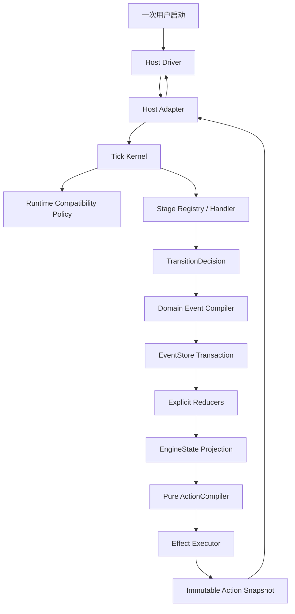

# Auto-Engineering v5.8 协议内核收敛设计

> 状态：已批准，待实施｜批准日期：2026-08-09｜对应 Phase：80（T403-T412）
> 上位基线：`BEACON.md`、`v5.7-Protocol-Kernel-Design.md`、
> `v5.7-Prompt-Contract-Design.md`、`v5.8-Session-Decoupling-Design.md`、
> `v5.8-Automatic-Context-Governance.md`

## 1. 决策摘要

采用“协议内核收敛重构”方案，不再针对单次真跑故障继续叠加点状分支。

1. Core 继续保持单 Tick、无 LLM、无后台 daemon 的确定性治理边界。
2. Host Runtime 在一次用户启动内持续驱动 Action → Result → 下一 Action；是否继续由
   机器可校验的 Execution Control 决定，不再只依赖 Skill 自觉。
3. 运行时兼容拆分为 Protocol、Event、Projection、Action Contract、Prompt、Policy
   六个维度；活动 Action 使用签发时修订完成，升级只在 Action 边界激活。
4. 新线程的状态推进由显式领域事件与 Reducer 完成，不再在每个 ResultAccepted 中写入
   完整 EngineState。旧事件流通过有期限的 Legacy Reducer 兼容。
5. ActionCompiler 纯化；UUID、clock、Artifact、proof 和日志写入由 Kernel 与
   Effect Executor 显式注入和执行。
6. TickOrchestrator 降为兼容 façade；按 Stage 逐步绞杀旧可变状态写入路径，不建立第二内核。
7. Phase 80 完成前冻结新的点状真跑修复。紧急 P0 必须先映射到本文不变量、事件和契约。

## 2. 问题定义

当前实现已经具备 Protocol Envelope、EventStore、StageHandler、Prompt Contract、
ExecutionSession 和 Host SPI，但核心执行仍集中于可变 TickOrchestrator：

- StageHandler 返回 `state_patch`、`cursor_operation` 等命令式上下文，façade 再解释并
  修改 EngineState、BatchState、ProgressTree 和多个运行时缓存。
- `ResultAccepted.state_patch` 实际携带完整 EngineState，使事件日志可重放但不能表达
  状态变化的领域原因。
- ActionBuilder 在编译过程中写 timestamp、UUID、Prompt Artifact 和 proof 文件，无法
  保证相同输入得到相同输出。
- Prompt Registry hash 绑定整个 EngineeringThread，普通 Prompt 更新会阻断已持久化
  active Action 的恢复。
- Command 中存在连续 while 驱动，但 Action Schema 和 Host SPI 没有合法停止条件，
  宿主在单个 Action 后停止仍无法被协议判错。
- 已废弃的固定 Tick/时间/上下文 rollover 原因仍保留在 Action Schema。

这些偏差共享同一根因：目标架构作为外壳叠加，旧内核没有被新契约替换。

## 3. 不可破坏的不变量

| ID | 不变量 | 约束 |
|---|---|---|
| PKC-I1 | Core 确定性 | Core 不调用 LLM、不解释 transcript、不复制宿主 Agent Runtime |
| PKC-I2 | 单 Tick 原子性 | Result、领域事件、Projection 和下一 Action 在一个事务内提交 |
| PKC-I3 | 宿主连续驱动 | 非终态且无用户阻断的 Action 必须在同一宿主 invocation 内自动续接 |
| PKC-I4 | Action 不可变 | 已签发 Action 的 message、Prompt、ContextManifest 和 runtime revision 不得重渲染 |
| PKC-I5 | 事件事实源 | 新状态事实必须由领域事件表达；Projection 可删除并由事件重建 |
| PKC-I6 | 会话不代理状态 | compaction 不改变 thread/session/stage/tick；Capsule 仅用于异常恢复 |
| PKC-I7 | 边界升级 | Prompt/Policy 更新只影响下一 Action；活动 Action 按签发修订完成 |
| PKC-I8 | 有界上下文 | 续跑、恢复和升级不得把完整历史、计划、日志或 Worker 正文重新内联 |
| PKC-I9 | 精确 fail-closed | 仅完整性损坏、未知必需语义或无 Migrator 时阻断，不以 build/hash 变化一概阻断 |
| PKC-I10 | 单内核迁移 | 旧 façade 可兼容委托，但不得与新 Kernel 并行推进同一业务状态 |

## 4. 目标架构



### 4.1 Core 与 Host 边界

Core 每次调用只执行一个 Tick，返回一个 Action；Core 不负责常驻循环。Host Driver
属于 Plugin/Skill/Command Runtime，负责在一次用户 invocation 中：

1. 读取并校验 Action。
2. 根据 Execution Control 决定继续、等待用户、终止、报错或异常接管。
3. 执行推理、工具和宿主原生 Worker。
4. 构建、预校验并提交 Result。
5. 在 `CONTINUE` 时立即读取下一 Action。

Host Driver 不拥有业务状态，不得根据 transcript 推断 Stage、Batch 或完成状态。

### 4.2 Tick Kernel 边界

Tick Kernel 固定执行：

```text
restore projection + active action
→ evaluate runtime compatibility
→ validate Result identity and causation
→ check idempotency
→ dispatch pure StageHandler
→ compile domain events
→ reduce candidate projection
→ evaluate invariant/gate/guardrail
→ compile next Action draft
→ execute declared effects
→ atomically commit events + projection + action snapshot
```

Kernel 不允许识别 `critic_progress`、`cursor_operation`、`initialize_architecture` 等
Stage 专属命令。Stage 变化必须表达为明确领域事件。

## 5. Host Execution Control

保持 Action/Result v1.1 核心字段不变，通过受约束扩展承载执行控制：

```json
{
  "extensions": {
    "ae": {
      "execution_control": {
        "schema_version": "1.0",
        "disposition": "CONTINUE",
        "continuation_required": true,
        "yield_allowed": false,
        "allowed_stop_reasons": []
      }
    }
  }
}
```

`disposition` 只允许：

| 值 | 含义 | Host 行为 |
|---|---|---|
| `CONTINUE` | 非终态自动工作 | 完成 Result 后立即取下一 Action，不向用户交回控制 |
| `WAIT_USER` | 缺少真实用户决策/授权 | 展示最小问题并等待，不伪造选择 |
| `TERMINAL` | Core 已产生 done | 展示 verdict 与新鲜验证后结束 |
| `ERROR` | 稳定不可继续错误 | 展示 error_code、证据和恢复方式后结束 |
| `HANDOFF_REQUIRED` | 真实进程恢复或跨宿主接管 | 执行 Capsule/claim；不得用于正常 compaction |

规则：

- `CONTINUE` 必须同时满足 `continuation_required=true`、`yield_allowed=false`。
- `WAIT_USER` 必须包含 `reason_code` 和所需决策/授权类型。
- Gate 若可由 Core 或宿主自动验证，仍为 `CONTINUE`；只有真实人工 gate 才是 `WAIT_USER`。
- Host 因额度、认证、宿主崩溃等外部原因中断时，不篡改业务状态；下次接触时记录
  `ExecutionInterrupted` 观测事实并恢复 active Action。
- 不新增用户可见 Supervisor 或会话管理命令。

## 6. Runtime Compatibility Vector

### 6.1 数据模型

```json
{
  "protocol_version": "1.1",
  "event_schema_version": "1.0",
  "projection_schema_version": "2.0",
  "action_contract_version": "1.0",
  "prompt_revision": "sha256",
  "policy_revision": "sha256",
  "engine_build_id": "5.8.0-rc.x"
}
```

语义：

- `protocol_version`：Action/Result Envelope 语义。
- `event_schema_version`：Event Envelope 与 payload discriminator。
- `projection_schema_version`：Reducer 输出的 EngineState 结构。
- `action_contract_version`：Execution Control、ContextManifest 等 Action 扩展契约。
- `prompt_revision`：本 Action 实际编译使用的 Prompt 组合摘要。
- `policy_revision`：Gate、Guardrail、预算和路由策略摘要。
- `engine_build_id`：审计信息，不单独作为阻断条件。

### 6.2 活动 Action 绑定

每个 Action Snapshot 必须保存：

```text
message_id
payload_sha256
runtime_revision
prompt/context artifact refs and hashes
issued_event_sequence
execution_control
```

签发后禁止使用新 Prompt 重建同一 `message_id`。若需要重编译，必须先以明确事件取消
旧 Action，再生成新 `message_id`；普通升级不得自动取消活动 Action。

### 6.3 恢复判定

1. 校验事件流、Projection 和 active Action 的完整性。
2. 若 Protocol/Event/Projection 版本需要迁移，调用注册的确定性 Migrator。
3. 若 active Action 存在且其协议仍受支持，原样恢复该 Action。
4. Prompt/Policy 与当前版本不同时，记录 pending revision，但不阻断旧 Result。
5. 旧 Result 原子接受后追加 `RuntimeRevisionActivated`，下一 Action 使用新修订。
6. 无 active Action 时可在当前 Action 边界直接激活新修订。
7. 只有无迁移器、完整性损坏或必需语义未知时返回稳定错误。

现有 `prompt_registry_hash` 仅作为 legacy 导入字段；新线程不再以线程级 Prompt hash
阻断恢复。

### 6.4 Build Identity

- SemVer 只表达公开版本，不再直接充当 `engine_build_id`。
- Release Builder 对进入制品的权威资产计算 SHA-256，在根目录与宿主插件目录写入同一
  `build-info.json`；Action 的 Runtime Revision 使用其中 `build_id`。
- 未打包源码运行时，对 `auto_engineering/` 的有效文件计算确定性摘要并使用
  `<version>+source.sha256.<digest>`，不得依赖 Git、当前工作目录或系统时间。
- 同一内容必须得到同一身份；同 SemVer 内容变化必须得到不同身份。缺失、损坏或版本
  不匹配的 build-info 只能回退到源码摘要，不能回退为裸 SemVer。

## 7. 事件与 Projection 收敛

### 7.1 新事件最小集合

| 领域 | 事件 |
|---|---|
| 生命周期 | `LoopInitialized`、`LoopCompleted`、`LoopFailed` |
| Action | `ActionIssued`、`ActionCompleted`、`ActionCancelled` |
| Stage | `StageAdvanced`、`StageStayed` |
| 计划 | `PlanPatched`、`BatchActivated`、`BatchCompleted`、`WorkReopened` |
| 发现 | `FindingOpened`、`FindingUpdated`、`FindingClosed` |
| 验证 | `GateResolved`、`VerificationEvidenceBound` |
| 架构 | `ArchitectureBaselineAccepted`、`ContractActivated` |
| 会话 | `ExecutionSessionStarted`、`ExecutionInterrupted`、`ExecutionSessionClosed` |
| 运行时 | `RuntimeRevisionDetected`、`RuntimeRevisionActivated` |

事件只携带该事实所需字段，不携带完整 EngineState。

### 7.2 Reducer 规则

- 每个事件类型对应显式、纯函数 Reducer。
- Reducer 只修改自己拥有的 State Channel。
- 未注册事件、未知必需 payload 或越权字段 fail-closed。
- Event Stream 的 sequence、causation、correlation 和 payload hash 继续强校验。
- Projection 存储仍可作为读缓存，但删除后必须只凭事件恢复。

### 7.3 Legacy 兼容

- 旧 `LoopInitialized/CheckpointImported` 可继续以完整 state 作为 seed。
- 任意旧事件只要携带历史 `state_patch`，必须先由统一 `LegacyEventAdapter` 只读还原
  patch，再把去除 legacy 字段后的规范事件交给严格 Reducer；不得按已知事件白名单漏适配。
- 新线程和迁移后的新 Tick 禁止继续生成完整 `state_patch`。
- EventStore 写边界拒绝任何新 `state_patch`；仅显式 `legacy_import=true` 的迁移导入可写。
- Legacy Reducer 至少保留一个候选版和一个正式小版本；退役必须有迁移统计与用户批准。

跨版本测试必须包含从真实故障流脱敏得到的固定 fixture，不得只用当前代码现场生成的
“旧流”替代历史 payload 形状。

## 8. ActionCompiler 与副作用

### 8.1 纯编译输入输出

```python
ActionDraft = ActionCompiler.compile(
    projection=state_view,
    transition=decision,
    identity=ActionIdentity(message_id=..., tick=...),
    runtime_revision=revision,
    clock=issued_at,
)
```

`ActionDraft` 包含 payload 与 `EffectIntent[]`。Compiler：

- 不写 EngineState。
- 不读取或写入全局 ContextVar。
- 不生成 UUID、不读取系统时间。
- 不创建目录、Artifact、proof 或 Prompt log。
- 相同显式输入产生字节等价输出。

### 8.2 Effect Executor

Effect Intent 类型首期限定为：

- `WriteContentAddressedArtifact`
- `CreateSpawnChallenge`
- `WritePromptDiagnostic`

Executor 执行后返回带 hash 的 `EffectReceipt[]`。Kernel 校验 receipt 后才允许提交
ActionIssued。无法原子包含在 SQLite 中的文件副作用采用 prepare → verify → commit：

1. 内容寻址写入临时/最终不可变路径。
2. 校验 hash、大小和路径边界。
3. SQLite 事务引用 receipt。
4. 事务失败时保留无引用不可变 blob，交由 retention 安全回收，不覆盖既有内容。

## 9. TickOrchestrator 绞杀迁移

迁移以行为切片进行，不按文件一次性重写：

1. Gap/Research：事件少，先建立新 Kernel 的完整闭环。
2. Verification：将 Gate、Finding 和进度改为显式事件。
3. Architect/PlanPatch：以 Baseline、PlanPatched、ContractActivated 表达变化。
4. Critic/Repair：以 Finding 和 WorkReopened 表达返修，不再回拨裸游标。
5. Developer：最后迁移 BatchActivated/Completed、Snapshot 和验证证据。
6. Terminal/Convergence：统一 LoopCompleted/Failed。

每个 Stage 切片完成时必须同时：

- 删除该 Stage 对应的旧 façade 写入分支。
- 禁止该 Stage 产生完整 state patch。
- 通过新旧黄金轨迹语义等价测试。
- 证明重复 Result、崩溃恢复和事件重放不重复推进。

禁止长期保留“新 Handler 生成决策、旧 façade 再解释”的双语义路径。

### 9.1 Architecture Candidate 单一语义

PLAN_REFINE 只能先执行一次确定性候选物化：

```text
Candidate = Baseline + PlanPatch.add_batches + contracts + obligations/updates
```

- dry-run、task/contract/obligation 校验、Stage Result 投影和 Architecture 激活必须消费
  同一 Candidate，任何消费者不得再次按自己的规则合并。
- `obligations=[]` 表示继承历史义务；新 source_ref 可作为新增 obligation 提交。
- 已有 source_ref 只能通过 `plan_patch.obligation_updates` 追加实现、验证或契约目标；
  禁止复制、覆盖或删除历史义务。
- Candidate 的完整 batch plan 与 BatchState 激活结果不一致时以
  `ARCHITECTURE_CANDIDATE_DRIFT` fail-closed，不得静默建立错误 baseline。

## 10. 协议与恢复遗留清理

- `session_rollover.reason` 收口为 `host_process_lost`、
  `context_compaction_failed`、`cross_host`、`manual_recovery`。
- `context_soft_limit`、`context_hard_limit`、`tick_limit`、`time_limit` 仅允许旧 Action
  兼容读取，新 Action Schema 不再生成或接受。
- `max_thread_ticks` 只用于不收敛诊断，不产生 handoff。
- `session_summary`、BEACON 和 recap 继续保持 informational，不能进入 Reducer。
- Prompt Registry 原始 hash 可用于 Action 编译审计，但不能作为整个 thread 的永久锁。

## 11. 可观测性与状态解释

公共 status 增加兼容扩展但保持现有稳定字段：

```json
{
  "execution": {
    "disposition": "CONTINUE",
    "active_action_id": "uuid",
    "interrupted": false
  },
  "runtime": {
    "active_revision": {},
    "pending_revision": null,
    "compatibility_status": "compatible"
  },
  "event_stream": {
    "last_sequence": 42,
    "legacy_patch_count": 0
  }
}
```

审计必须能回答：为何继续/停止、哪个 Action 在活动、使用哪个 Runtime Revision、
是否发生迁移、Projection 由哪些事件推进。

## 12. 禁止项

- 禁止用“忽略 Prompt hash”替代 Action 边界兼容策略。
- 禁止把 continuous driver、daemon 或 LLM 调用放入 Core。
- 禁止新增用户可见 Supervisor、rollover 管理命令或固定 Tick 交接。
- 禁止重渲染已签发 Action 并复用原 message_id。
- 禁止在 ResultAccepted 中继续写新 Tick 的完整 EngineState。
- 禁止 Builder 同时承担纯编译和文件副作用。
- 禁止为让测试通过而降低 Gate、Guardrail、验证或设计标准。
- 禁止以总代码行数作为重构完成标准。
- 禁止在 Phase 80 外继续增加无法映射到本文不变量的点状修复分支。

## 13. 迁移与发布顺序

| Wave | 范围 | 出口 |
|---|---|---|
| 80A | 架构特征与负向契约 | 当前偏差可重复失败；无生产状态变更 |
| 80B | Runtime Vector + Action 边界升级 | 跨 Prompt/Policy 版本活动 Action 可继续 |
| 80C | Execution Control + Host Driver | 双宿主对 CONTINUE/WAIT/TERMINAL 等价 |
| 80D | Event Reducer + Legacy Adapter | 新路径零完整 state patch；旧流可重放 |
| 80E | Pure Compiler + Effects | 相同输入字节等价；副作用可故障注入 |
| 80F | Stage-by-stage Kernel strangling | 旧 Stage 写入路径逐个归零，无双推进 |
| 80G | 协议清理与发布验收 | 跨版本 150 Tick、双宿主、成本和故障门禁通过 |

只有前一 Wave 出口通过，后一 Wave 才可开始。不得用一次全量重写跳过中间兼容边界。

## 14. EARS 总体验收

1. While Action 非终态且无需用户输入, when 宿主提交 Result, the host shall 自动执行
   下一 Action，不向用户交回控制。
2. While 活动 Action 由旧 Prompt/Policy Revision 签发, when 新版本恢复线程, the Core
   shall 接受其合法因果 Result，并只对下一 Action 激活新 Revision。
3. While Projection 被删除, when 新事件流重放, the system shall 不依赖逐 Tick 完整
   EngineState 快照重建等价状态。
4. While 旧事件流包含完整 state patch, when 兼容恢复运行, the system shall 通过
   Legacy Reducer 重放并显式报告 legacy，而不改写历史事件。
5. While 相同显式输入、identity 和 clock 被提供, when Action 编译两次, the compiler
   shall 生成字节等价草案且不产生文件写入。
6. While Tick 增长且业务持续前进, when 上下文治理运行, the system shall 不产生
   session rollover 或人工交接。
7. While Host 在 `CONTINUE` Action 后异常停止, when status 或下一次恢复运行, the
   system shall 报告 ExecutionInterrupted 并恢复同一 active Action。
8. While Claude Code 与 Codex 执行同一跨版本黄金轨迹, when 两者到达终态, their Core
   event semantics、Projection 和 verdict shall 等价。
9. While Worker、日志或 Prompt 产生大型内容, when 下一 Action 编译, the system shall
   只内联有界唯一块并以 ArtifactRef 引用完整内容。
10. While Phase 80 自动门禁通过但真实产品轨迹未执行, when 发布报告生成, the release
    shall 保持 blocked，不把 archive smoke 表述为产品验收。

## 15. 决策记录

| ID | 决策 |
|---|---|
| PKC-D1 | 采用协议内核收敛重构，冻结新的点状真跑补丁 |
| PKC-D2 | Core 保持单 Tick；连续自动运行由 Host Driver 承担 |
| PKC-D3 | Execution Control 作为 Action v1.1 兼容扩展，机器化合法停止条件 |
| PKC-D4 | 运行时兼容拆为六维 Vector，engine build 不单独阻断 |
| PKC-D5 | 活动 Action 按签发修订完成，Runtime 只在 Action 边界激活 |
| PKC-D6 | 新状态事实使用显式领域事件；完整 state patch 只作 legacy 读取 |
| PKC-D7 | ActionCompiler 纯化，副作用通过 EffectIntent/Receipt 隔离 |
| PKC-D8 | TickOrchestrator 以行为切片绞杀，不建立第二内核或一次性重写 |
| PKC-D9 | 固定 Tick/时间/普通上下文阈值不得触发 session handoff |
| PKC-D10 | Phase 80 只有跨版本、双宿主、长轨迹和真实产品门禁通过才可关闭 |
