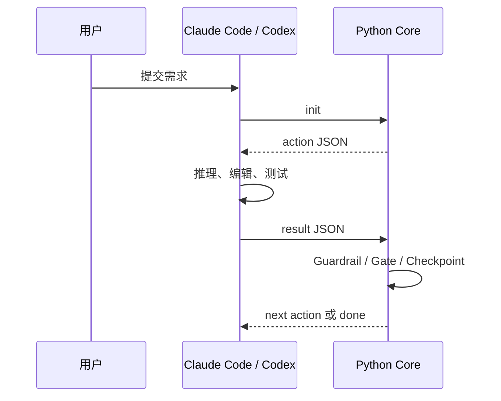

# Auto-Engineering 产品培训手册

> 适用对象：内部开发者、技术负责人、产品与交付人员
> 适用版本：5.6.0｜更新：2026-07-27

## 1. 一句话定位

Auto-Engineering 是跨 Claude Code 与 Codex 的工程循环调度器：宿主 Agent 负责推理和
工具调用，Python Core 负责确定性流程、门禁、验证与恢复。

## 2. 入口演示

| 宿主 | 演示入口 |
|---|---|
| Claude Code | `/auto-engineering:dev-loop "需求"` |
| Codex | `$auto-engineering`，随后描述需求 |

演示前执行：

```bash
ae-run doctor
ae-run dev-loop --init "需求"
```

第二条命令只产生 action，不在 Python 内调用 LLM。

## 3. 核心价值

1. **跨宿主复用**：一套 Core、一套 schema、一套验证语义。
2. **过程可恢复**：每个 Tick 独立进程，状态进入 SQLite checkpoint。
3. **质量确定性**：Guardrail、Gate 与五层验证不是提示词承诺。
4. **边界清晰**：Init Engineering 独立；本项目默认本地探测，旧 manifest 仅作只读兼容输入。
5. **可审计**：设计、配置、测试基线与 Release 报告都有唯一事实源。

## 4. Tick 生命周期



Agent 的“完成声明”不等于流程完成；只有 Core 接受 result、门禁通过并输出下一 action
或 `done`，状态才推进。

## 5. 标准演示

1. 确认项目存在可识别的源码、测试或 `ae.toml`；若有 `.ae-state/init-manifest.json`，仅核对其只读兼容状态。
2. 运行 `ae-run doctor`，解释宿主、依赖和功能面板。
3. 从宿主入口提交小需求。
4. 展示 action/result 离散交互。
5. 展示 `ae-run status --format json` 和恢复。
6. 展示测试、Gate 与 review 证据。

手工协议：

```bash
ae-run dev-loop --init "需求"
ae-run dev-loop --tick --result result.json
ae-run status --format json
ae-run dev-loop --resume
```

## 6. 质量与金融科技边界

Guardrail 约束 Stage；Gate 执行 safety、lint、type check、audit、contract、test、
build；五层验证从 diff 级逐步扩大到系统深审。必需验证不能因 Agent 自述而省略。

金融科技演示额外强调：

- PII 默认保护与测试数据虚构化。
- 金额使用定点数或 Decimal。
- Git、发布和生产写入需人类明确授权。
- 自动化不承担监管签署或发布审批责任。

## 7. 配置与 Provider

`FeatureManifest` 是全部 `AE_*` 默认值唯一事实源，`RuntimeConfig` 是访问层。培训时
用 `ae-run doctor` 展示，不复制另一套默认值。

```bash
uv sync --extra anthropic
uv sync --extra openai
```

Provider SDK 按需安装，不改变 Core 的宿主中立性。

## 8. Release 验收

自动流水线能证明归档结构、隔离安装、doctor 和最小 Tick；不能证明真实产品安装。
报告必须分别保留 `archive_smoke` 与 `product_install`，后者未执行时为 `not_run`。

## 9. 常见误区

**Python Core 会自动调用模型。** Core 只调度，模型由当前宿主 Agent 提供。

**Claude 与 Codex 有两套引擎。** 只有一套 Tick Core，差异在 Host Adapter。

**自动 Release smoke 等于真实产品安装。** 真实安装必须在对应产品中单独验证。

**Plugin manifest 定义运行默认值。** 默认值只来自 `FeatureManifest`。

## 10. 培训验收题

1. Claude Code 与 Codex 的入口分别是什么？
2. 为什么 action/result 要通过离散 Tick 交换？
3. `HostAdapter` 隔离哪五类宿主差异？
4. 为什么 `archive_smoke=pass` 不能推出 `product_install=pass`？
5. 配置默认值的唯一事实源在哪里？

答案见 `design/v5.6-Design-Loop.md`、`docs/USER_GUIDE.md` 和
`docs/api-reference.md`。历史里程碑与恢复方式见 `design/HISTORY.md`。
